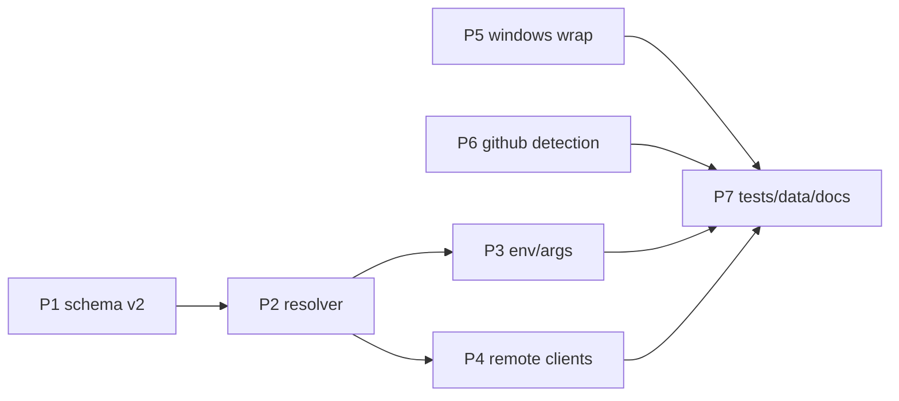

# mcp-forge: Multi-Runtime Install Support — Build Plan

Companion to `install-research.md`. Goal: make `mcp-forge install` produce **correct, launchable client config entries** for node, python, docker, binary, and remote MCP servers — instead of assuming everything is `npx -y`-able.

---

## 0. Current state (evidence from code)

| Piece | File | Behavior today |
|---|---|---|
| Registry entry | `src/lib/registry.json` | `{name, description, package: string\|null, github: string\|null, category}` — 267 entries, **8 with npm package, 259 github-only**. No runtime, env, args, or remote info. |
| Launch resolution | `src/lib/registry.ts` `resolveLaunch()` | `package` → `npx -y <pkg>`; else `github` → `npx -y github:owner/repo`; else throw. |
| Custom installs | `src/commands/install.ts` | `--npm` → `npx -y <pkg>`; `--github` → `npx -y github:owner/repo`. |
| Persisted entry | `src/lib/config.ts` `ServerEntry` | Has `env?: Record<string,string>` **but install never populates it**; `install.ts:120` passes only `{command, args}` to `configureClients`. |
| Client writers | `src/lib/clients.ts` | Writes `{command, args, env?}` under `mcpServers` to Claude Code (`~/.claude.json`, `+ type:"stdio"`), Claude Desktop, Cursor. **stdio-only**; no remote (`url`) entry shape. |
| Windows | `src/lib/windows.ts` | `toSpawnCommand` shell-wraps for mcp-forge's *own* spawns — but client configs get bare `npx`, while official docs instruct `cmd /c npx` wrapping on Windows. |

### Why this breaks (from research)

- **Python servers** (fetch, git, time — among the most-installed servers in existence) need `uvx mcp-server-*`. Today they resolve to `npx -y github:modelcontextprotocol/servers` — which "runs" the monorepo **root** (not a Node package with a bin) and fails.
- **Go/binary servers** (github-mcp-server, korotovsky/slack) aren't npx-able at all.
- **Monorepo subfolders**: `github:owner/repo` can't select `src/git`.
- **Remote-only servers** (large share of the official registry) have no local command.
- **Required env/args**: filesystem *requires* allowed-dir positionals; github needs `GITHUB_PERSONAL_ACCESS_TOKEN`. Installs without them produce dead entries.

---

## Phase 1 — Registry schema v2

Extend `RegistryServer` with optional launch metadata, using the **official registry vocabulary** (`registryType`, `identifier`, env/arg Input shape) so entries can later be synced straight from `registry.modelcontextprotocol.io`:

```jsonc
{
  "name": "git",
  "description": "Tools to read, search, and manipulate Git repositories",
  "category": "reference",
  "github": "modelcontextprotocol/servers",
  "subfolder": "src/git",                          // NEW: monorepo location
  "install": {                                     // NEW: how to launch locally
    "registryType": "pypi",                        // npm | pypi | oci
    "identifier": "mcp-server-git"
  },
  "args": [                                        // NEW: server args
    { "type": "named", "name": "--repository", "valueHint": "repo_path", "required": false }
  ],
  "env": [                                         // NEW: env vars
    { "name": "GITHUB_PERSONAL_ACCESS_TOKEN", "required": true, "secret": true, "description": "PAT with repo scope" }
  ],
  "remote": {                                      // NEW: hosted endpoint
    "type": "streamable-http",                     // streamable-http | sse
    "url": "https://api.githubcopilot.com/mcp",
    "headers": [ { "name": "Authorization", "secret": true, "required": true, "valueTemplate": "Bearer {token}" } ]
  },
  "package": "@old/legacy"                         // legacy field, still accepted
}
```

Rules:
- All new fields optional. `isRegistryServer` validation extended; **legacy `package: string` is normalized at load** to `install: {registryType: "npm", identifier}` (custom registries via `MCP_FORGE_REGISTRY_URL` keep working).
- An entry may have `install`, `remote`, both, or neither (github-only → Phase 6 fallback).
- Bundled `registry.json` migration: annotate from the official registry API + the top-30 upstream READMEs (start with the 10 researched: filesystem, memory, sequential-thinking, everything, git, fetch, time, github, playwright, context7). The github-only tail keeps working via fallback + install-time warning.

**Accept:** load/validate both shapes; the 10 researched servers carry correct `install`/`remote`/`env`/`args` metadata; `npm test` green.

## Phase 2 — Launch resolution engine

Rewrite `resolveLaunch()` to return a discriminated union:

```ts
type LaunchSpec =
  | { kind: 'stdio'; target: string; command: string; args: string[]; env: Record<string, string> }
  | { kind: 'remote'; transport: 'http' | 'sse'; url: string; headers: Record<string, string> };
```

Mapping (from research §1.2):

| `registryType` | Command construction |
|---|---|
| `npm` | `npx -y <identifier>` (append `@<version>` when pinned) |
| `pypi` | `uvx <identifier>` |
| `oci` | `docker run -i --rm [-e KEY]* <identifier>` (one `-e` per env var, values via `env`) |
| — remote only | no command; `remote.url` + headers |
| — none (github-only) | Phase 6 detection, else today's `npx -y github:` with a warning |

Tradeoff (recorded from review): this maps launcher from `registryType` and drops the official `runtimeHint` field. Simpler for the hand-curated registry, but future sync from the official API needs a lossy mapping layer. The alternative — storing official `packages[]`/`remotes[]` verbatim and honoring `runtimeHint`/`runtimeArguments` — makes sync a zero-mapping copy at the cost of a richer resolver. Revisit at Phase 7 when the sync script is written; switching then only touches `resolveLaunch` and the registry validator.

Preflight: before persisting, check the launcher exists (`npx`/`uvx`/`docker` `--version` via `toSpawnCommand`, `spawnSync`). Missing → fail with install hint (`uv: https://docs.astral.sh/uv/getting-started/installation/`). Never shell-interpolate user values beyond the existing Windows pre-join (schema's command-injection warning; POSIX stays `shell: false`).

**Accept:** unit matrix — npm/pypi/oci/remote/legacy-string/none each resolve correctly; missing-launcher path errors with hint.

## Phase 3 — Env vars and args at install time

- `install --env KEY=VALUE` (repeatable) and `--arg <value>` (repeatable, fills `valueHint` slots in declared order).
- Required-but-missing env/args: prompt interactively (secret → masked); non-TTY → fail listing exactly what's missing.
- Persist into `ServerEntry.env`/`args` (types already allow env) and **pass env through to `configureClients`** (fixes the existing drop at `install.ts:120`).
- Print a one-line notice that values are stored plaintext in client configs (ecosystem status quo).

**Accept:** installing `github` (binary/docker variant) with `--env GITHUB_PERSONAL_ACCESS_TOKEN=x` lands the key in all three client configs' `env`; installing `filesystem` without dirs fails/prompts naming the missing arg.

## Phase 4 — Remote servers in clients.ts

`McpServerDefinition` becomes a union (stdio | remote). Per-client entry shapes (research §2.8, §3):

| Client | Remote entry |
|---|---|
| Claude Code (`~/.claude.json`) | `{ "type": "http" \| "sse", "url", "headers" }` |
| Cursor (`~/.cursor/mcp.json`) | `{ "url": ... }` |
| Claude Desktop | No native remote config → default **skip with reason** ("remote server — connect via claude.ai connectors or rerun with `--bridge`"); `--bridge` writes `npx -y mcp-remote <url>`. Boring default: no surprise dependency. |

`remove` already keys by name — unaffected. `status`/`runner`: remote entries are not spawnable; show `remote` badge, skip PID logic (runner change is display-only this phase).

**Accept:** e2e — installing a remote entry writes `type:"http"` to `.claude.json`, `url` to Cursor, skips Desktop with reason; `remove` cleans all three.

## Phase 5 — Windows client-config correctness

Per official guidance (servers README): on win32, npm-ecosystem shims must be wrapped for Claude Desktop. When `process.platform === 'win32'` and command is `npx`/`npm`/`pnpm`, write `{ "command": "cmd", "args": ["/c", "npx", ...] }`; leave `uvx`/`docker`/binaries unchanged. Apply uniformly to all three clients (`cmd /c npx` is valid everywhere; avoids per-client speculation). Keep the APPDATA-in-`env` workaround documented in README troubleshooting, not auto-written.

**Accept:** unit test on win32 path builds the wrapped entry; POSIX untouched.

## Phase 6 — `--github` runtime detection (escape hatch)

For `--github owner/repo` and github-only registry entries, probe raw.githubusercontent.com (5s timeout, same pattern as `fetchRegistry`):

1. `package.json` with `bin` → Node: prefer published `name` (`npx -y <name>`), else `npx -y github:owner/repo`.
2. else `pyproject.toml` → Python: `uvx --from git+https://github.com/owner/repo <script>` using the sole `[project.scripts]` entry; multiple/none → fail listing candidates.
3. else `go.mod`/`Cargo.toml` → fail with "requires a release binary or Docker image — see the repo's README" (auto-download out of scope).
4. Detection failure → current behavior + warning, so nothing regresses.

**Accept:** unit tests with mocked fetches for each branch; `--github modelcontextprotocol/servers` no longer silently produces a broken entry (monorepo root has no `bin` → guided failure).

## Phase 7 — Tests, data migration, docs

- Extend `tests/e2e-clients.test.mjs` for: pypi install (uvx entry in all configs), remote install, env passthrough, Windows wrap (env-forced platform branch where feasible).
- Annotate bundled registry.json top-30 (script cross-referencing the official registry API by repository URL; manual for the 10 researched).
- README: new flags (`--env`, `--arg`, `--bridge`), runtime column in `mcp-forge list`, launcher prerequisites table (node→npx, python→uvx, docker).

**Accept:** `npm test` + `npm run build` clean; `mcp-forge install git` (registry) produces `uvx mcp-server-git` entries end-to-end on a machine with uv installed.

---

## Dependencies & order



P5 and P6 are independent of P1–P4 and can be built in parallel.

## Risks

- **Command injection** (called out in the official schema): keep POSIX `shell: false`; Windows stays pre-joined via `toSpawnCommand`; never pass user args through a shell string on POSIX.
- **Registry data quality**: annotations are hand-curated until synced from the official API; the legacy fallback + install-time warning keeps unannotated entries no worse than today.
- **Claude Desktop remote support** may ship natively later; the skip-with-reason default degrades gracefully into "just flip to native entry" when it does.
